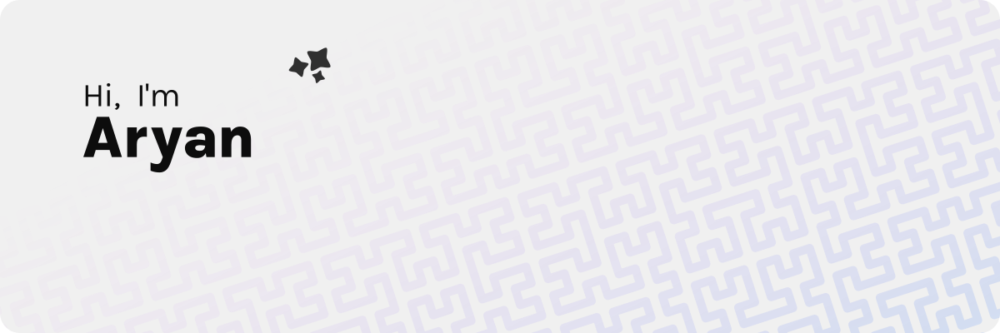

### Hi there 👋

<table border="0">
  <tr>
    <td colspan="2">
      <picture>
        <source
          media="(prefers-color-scheme: dark)"
          srcset="images/banner.png"
        />
        
      </picture>
    </td>
  </tr>
  <tr>
    <td rowspan="2">
      <picture>
        <source
          media="(prefers-color-scheme: dark)"
          srcset="userfetch/info.svg"
          width="390"
        />
        
      </picture>
    </td>
    <td>
      <picture>
        <source
          media="(prefers-color-scheme: dark)"
          srcset="https://github-readme-stats.vercel.app/api?username=aryan02420&show_icons=true&hide_title=true&hide_border=true&border_radius=12&include_all_commits=true&count_private=true&bg_color=18181B&icon_color=4ade80&text_color=fcfcfc&title_color=4ade80"
          width="380"
        />
        
      </picture>
    </td>
  </tr>
  <tr>
    <td>
      <picture>
        <source
          media="(prefers-color-scheme: dark)"
          srcset="https://github-readme-stats.vercel.app/api/top-langs/?username=aryan02420&layout=compact&hide_title=true&langs_count=6&hide_border=true&border_radius=12&card_width=380&bg_color=18181B&icon_color=4ade80&text_color=fcfcfc&title_color=4ade80"
          width="380"
        />
        
      </picture>
    </td>
  </tr>
</table>

 

<table>
<tr>
<td>
<h4>

🕹️ Play a Game

<!--START_SECTION:wreadle--><!--VAR:wreadle state=a0b0jj4gn0g418j000hrk8rqo4p2o4sqlbbo-->

<h2 align="center"> WORDLE</h2>

&nbsp;&nbsp;&nbsp;&nbsp;&nbsp;

&nbsp;&nbsp;&nbsp;&nbsp;&nbsp;

&nbsp;&nbsp;&nbsp;&nbsp;&nbsp;

&nbsp;&nbsp;&nbsp;&nbsp;&nbsp;

&nbsp;&nbsp;&nbsp;&nbsp;&nbsp;

&nbsp;&nbsp;&nbsp;&nbsp;&nbsp;

 

 &nbsp; &nbsp; &nbsp; &nbsp; &nbsp; &nbsp; &nbsp; &nbsp; &nbsp; &nbsp;

 &nbsp; &nbsp; &nbsp; &nbsp; &nbsp; &nbsp; &nbsp; &nbsp; &nbsp;

 &nbsp; &nbsp; &nbsp; &nbsp; &nbsp; &nbsp; &nbsp; &nbsp; &nbsp;

    
How to play?

    <ul>
      <li><a href="https://en.wikipedia.org/wiki/Wordle">What is wordle?</a></li>
      <li>Press a key</li>
      <li>Watch the timer for one complete cycle.</li>
      <li>Refresh</li>
      <li>Repeat</li>
    </ul>
  

<!--END_SECTION:wreadle-->

</h4>
</td>
</tr>
</table>

<!--
**aryan02420/aryan02420** is a ✨ _special_ ✨ repository because its `README.md` (this file) appears on your GitHub profile.

Here are some ideas to get you started:

- 🔭 I’m currently working on ...
- 🌱 I’m currently learning ...
- 👯 I’m looking to collaborate on ...
- 🤔 I’m looking for help with ...
- 💬 Ask me about ...
- 📫 How to reach me: ...
- 😄 Pronouns: ...
- ⚡ Fun fact: ...
-->
